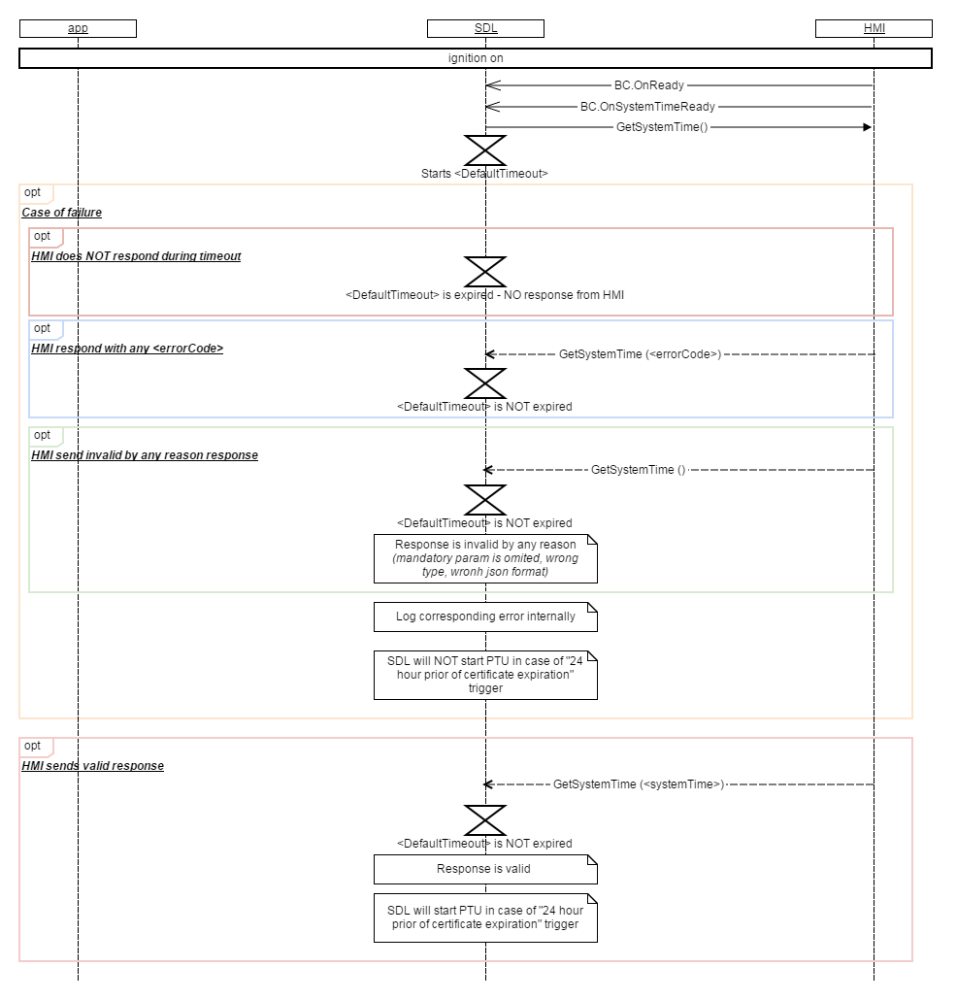
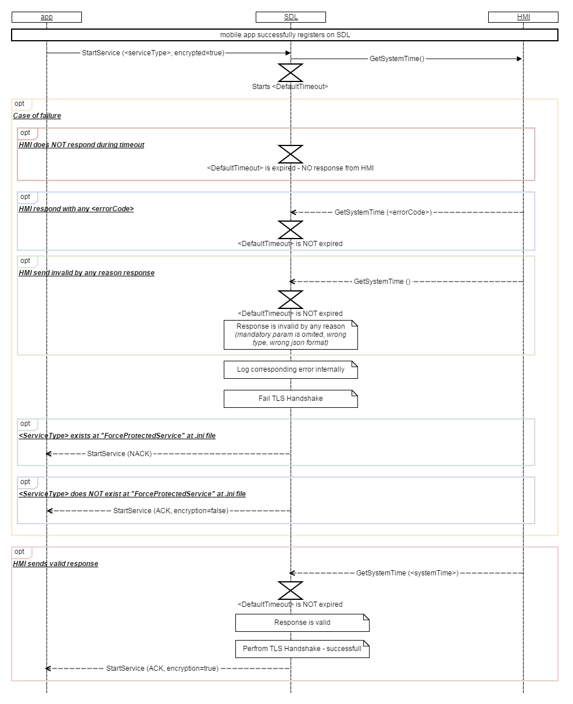

## Functional requirements

1.  
In case  
mobile app successfully registers on SDL and sends the very first request to open protected service (starts TLS/DTLS Handshake process)  
and HMI sends BC.OnSystemTimeReady to SDL

SDL must  
- send GetSystemTime request to HMI  
- start `<DefaultTimeout>` for waiting response from HMI (value from .ini file)

2.  
In case  
SDL sends GetSystemTime request to HMI before request to open protected service from mobile app  
and mobile and sdl certificates are valid  
and HMI sends valid response during `<DefaultTimeout>`  

SDL must  

- perform DTLS Handshake with mobile app  
- send OnServiceUpdate(service_Type, REQUEST_ACCEPTED) notification to HMI  
- send START_SERVICE_ACK, encryption = true to mobile app  
 
3. In case  
SDL gets GetSystemTime response from HMI  
and mobile and SDL certificates are not valid according to date/time from GetSystemTime response  

SDL must  
- trigger PTU  
- send OnServiceUpdate(service_Type, INVALID_CERT)   
- respond START_SERVICE_NACK, encryption = false to mobile app in case of receiving one more time expired certificate during PTU

4.  
In case  
SDL sends GetSystemTime request to HMI after BC.OnSystemTimeReady  
and at least one of the following failures happens:  

a) HMI does NOT respond during `<DefaultTimeout>`  
b) HMI respond with any `<errorCode>` during `<DefaultTimeout>`  
c) HMI sends invalid by any reason response  

SDL must  
- log corresponding error internally  
- fail Handshake  
- send OnServiceUpdate(service_Type, INVALID_TIME) notification to HMI  


## Non-functional requirements 

### Additions to HMI_API

**GetSystemTime request/response**  

```
<interface name="BasicCommunication" version="< >" date="< >">
<function name="GetSystemTime" messagetype="request">
    <description>Request from SDL to HMI to obtain current UTC time.</description>
</function>
<function name="GetSystemTime" messagetype="response">
    <param name="systemTime" type="Common.DateTime" mandatory="true">
      <description>Current UTC system time</description>
    </param>
  </function>
```

**OnSystemTimeReady notification**  

```
<interface name="BasicCommunication" version="< >" date="< >">
<function name="OnSystemTimeReady" messagetype="notification">
    <description>HMI must notify SDL about readiness to provide system time.</description>
</function>
```
New struct "DateTime" must be added to MOBILE_API and HMI_API:  
```
<struct name="DateTime">	
		<param name="millisecond" type="Integer" minvalue="0" maxvalue="999" mandatory="false">
			<description>Milliseconds </description>		
		</param>
		<param name="second" type="Integer" minvalue="0" maxvalue="60" mandatory="false">			
			<description>Seconds part of time</description>		
		</param>			
		<param name="minute" type="Integer" minvalue="0" maxvalue="59" mandatory="false">			
			<description>Minutes part of time</description>		
		</param>			
		<param name="hour" type="Integer" minvalue="0" maxvalue="23" mandatory="false">			
			<description>Hours part of time. Note that this structure accepts time only in 24 Hr format</description>		
		</param>			
		<param name="day" type="Integer" minvalue="1" maxvalue="31" mandatory="false">			
			<description>Day of the month</description>		
		</param>			
		<param name="month" type="Integer" minvalue="1" maxvalue="12" mandatory="false">			
			<description>Month of the year</description>		
		</param>			
		<param name="year" type="Integer" minvalue="0" maxvalue="4095" mandatory="false">			
			<description>The year in YYYY format</description>		
		</param>			
		<param name="tz_hour" type="Integer" minvalue="-12" maxvalue="14" mandatory="false">			
			<description>Time zone offset in Hours with regard to UTC.</description>		
		</param>			
		<param name="tz_minute" type="Integer" minvalue="0" maxvalue="59" mandatory="false">			
			<description>Time zone offset in Min with regard to UTC. </description>		
		</param>			
	</struct>
```

## Diagram

GetSystemTime

  

  
